# EXECUTION — параллельная разработка через вложенные worktree

> Всё внутри одного проекта `skai_7`. Параллельность — через **git worktree в `.worktrees/`**
> (папка игнорируется git), каждая открывается **отдельным окном VS Code** со своей сессией Claude Code.
> Источник истины — `00-CONTRACT.md`.
>
> **Принцип деления на волны:** по приоритету продукта (P0→P1→P2) и треку (backend ∥ web ∥ tests),
> граница между треками — контракт. Одна фича размазана по нескольким промптам и собирается на барьере —
> поэтому сквозная проработанность каждой идеи #1–#10 (data→backend→web→tests→приёмка) и единый
> **Definition of Done** вынесены в [`FEATURES.md`](FEATURES.md) — карта для ведущего и оператора барьера.
> Сама глубина (edge-cases, негативы, состояния loading/empty/error, a11y, локали) **впечатана в секцию
> `## Check` каждого фич-промпта** (`b7`–`b14`, `f5`–`f14`, `d4`/`d5`) — её видит исполнитель.
> P0-промпты Волны 1 (`b2`,`f4`,`b3`,`d2`) уже выполнены, поэтому их Opus-доработка вынесена в отдельные
> промпты **`b14`/`f14` и `b15`/`d6` (Волна 2.1)** — правка поверх готового кода, а не переисполнение Волны 1.

## Модель-исполнитель по промптам

> Каждый промпт помечен рекомендуемой моделью (тег продублирован в blockquote-шапке самого промпта).
> Это **прод-решение — на сложном не экономим**. Критерий:
> **🟢 Qwen 3.7 max** — только реально простое: scaffold / токены / транскрипция / данные с **тотальным**
> гейтом (ошибка ловится структурно).
> **🔵 Sonnet** — чёткая детерминированная логика/вёрстка в одном файле против контракта, ограниченный
> blast-radius (включается, только когда это оправдано — не как дефолт).
> **🔴 Opus** — высокие ставки: спайн данных, синк/алгоритм, killer-feature, сложный интерактив
> (overlay/focus-trap/очередь), кросс-экранное состояние, анти-регресс и **все барьеры**
> (судят green/red, продвигают `main`, заводят дефекты).
>
> **Правило эскалации:** если секция `## Check` 🟢/🔵-промпта дважды подряд красная — этот конкретный
> прогон переводится на Opus (тег в файле не меняем). Тег — ориентир по умолчанию, а не жёсткий запрет.

| Модель | Промпты |
| --- | --- |
| 🟢 Qwen (8) | `b1`, `b4`, `d1`, `f1`, `f3`, `t4`, `w3-2`, `t5` (CURRENT_STATUS · W4.3) |
| 🔵 Sonnet (65) | **W1:** `b2`,`b5`,`b6`,`d3`,`f2` · **W2.1:** `b7`,`b8`,`b10`,`b14` · **W2.2:** `b11`,`b12`,`d4`,`f5`,`f8`,`f12` · **W2.3:** `t1`,`t2`,`t3`,`tu-*` (6) · **W3:** `w3-1`,`w3-3`,`w3-4`,`w3-5`,`w3-6`,`w3-7`,`w3-8`,`w3-10`,`w3-11`,`w3-12`,`w3-13`,`w3-14`,`w3-15`,`w3-16`,`w3-17`,`w3-18`,`w3-19` (w3-16…19 = prep В.4) · **W4.1:** `b17`,`b20`,`b24`,`d7`,`tu-scene/weather/forecast/zones/fatigue` · **W4.2:** `b22`,`b23`,`f15`,`f16`,`f19`,`tu-copilot`,`t-wave4-frontend` · **W4.3:** `b25`,`b27`,`f20`,`f21`,`t6`,`tu-metrics/security/riskbreakdown` |
| 🔴 Opus (33) | **фичи:** `b3` (спайн), `d2` (синк-примитивы), `f4` (флагман P0+синк), `b9` (двухпутевой NLU), `b13` (3 домена #5/#6/#7), `d5` (voice-UI killer #2), `f6` (дедуп+роли карты), `f7` (killer), `f9` (overlay/focus-trap/очередь), `f10` (таймлайн↔видео синк), `f11` (РЭБ-валидатор), `f13` (кросс-экранные роли), `f14` (анти-регресс #1) · **доработки Волны 1:** `b15`,`d6` · **W3:** `w3-9` (кросс-доменный join fleet-health) · **AI-слой (Волна 4):** `b16` (VLM-пайплайн), `b18` (прогноз-алгоритм), `b19` (DBSCAN-зоны), `b21` (copilot tool-use), `f17` (чат-UI), `f18` (heatmap-карта), `b26` (security-baseline · W4.3) · **барьеры:** `x1`,`x2`,`x3`,`x4`,`x4a`,`x4b`,`x5`,`x6`,`x7`,`x8` |

> Итог: **🟢 8 · 🔵 65 · 🔴 33** (106 промптов; +4 prep-промпта В.4 `w3-16…19`, +барьер `x8`; +полнота 4.3: `b27` + `tu-metrics/security/riskbreakdown`). Прод-приоритет: на сложном не экономим — Opus покрывает спайн/синк/
> killer/сложный интерактив/кросс-экранное состояние/breadth/анти-регресс + барьеры; Qwen — только
> тривиально-механическое; Sonnet — оправданный детерминированный «середняк».
> **Волна 1 заморожена** (`b1`–`f4` выполнены) — её Opus-глубина (по `b3`/`d2`) перенесена в доработки
> `b15`/`d6` (Волна 2.1), а не переисполнением Волны 1; для `b2`/`f4` это уже `b14`/`f14`.

## Структура
```
skai_7/
├── api/  web/  prompts/  ...        ← основной чекаут (ветка main)
└── .worktrees/            (gitignored)
    ├── backend  [feat/backend]      ← окно 1: api/, data/seed/
    ├── web      [feat/web]          ← окно 2: web/
    └── tests    [feat/tests]        ← окно 3: Claude Code · track-t-tests (api/tests, web vitest)
```
В каждой `.worktrees/<name>/START.md` — очередь промптов и владение.

## Как открыть в VS Code (каждую — своим окном)
```bash
code /Users/dimausac/projects/skai_7/.worktrees/backend
code /Users/dimausac/projects/skai_7/.worktrees/web
code /Users/dimausac/projects/skai_7/.worktrees/tests
```
Или File → Open Folder → выбрать папку worktree → Open in New Window. В каждом окне открой панель
Claude Code и дай промпт волны (см. START.md). Окна работают **одновременно** — разные ветки, разные файлы.

### Как запускать промпт в Claude Code

**Один промпт = одна задача Claude Code.** В нужном окне открой панель Claude Code и дай команду:

```text
Выполни промпт @prompts/v2-fullstack/wave-1-p0/track-b-backend/b1-duckdb-etl.md
```

(`@`-ссылка подставит файл; либо просто «выполни b1»). Дождись завершения и проверки, затем следующий
по очереди из `START.md`. Промпты одной под-волны без зависимостей (например `b2`∥`b4`) можно дать сразу.

> **Один промпт = один коммит (обязательно).** Каждый промпт Волны 2+ заканчивается секцией
> `## Коммит` — после зелёного `## Check` сразу `git add -A && git commit -m "<id>: …"` в свою ветку.
> Без этого работа остаётся незакоммиченной в worktree, а **merge на барьере берёт только коммиты** —
> и волна «потеряется». Все барьеры, сливающие `feat/*` (`x1`,`x2`,`x4a`,`x4b`,`x4`,`x5`), дополнительно
> содержат GUARD: стоп, если в любом worktree есть незакоммиченные изменения
> (`git -C .worktrees/<w> status --porcelain` не пуст).

### Где запускать барьеры

Барьеры (`x1`–`x4`) выполняются **НЕ в worktree, а в основном окне `skai_7`** на ветке `integration`:

```bash
code /Users/dimausac/projects/skai_7        # основное окно (или просто оно уже открыто)
```

Затем в Claude Code этого окна просто дай промпты по одному —
`@prompts/v2-fullstack/barrier-1-p0/x1-remove-streamlit.md` → `x2` → `x3` (→ `x4` на барьере 2).
**Каждый x-промпт самодостаточен:** содержит свою git-склейку веток на `integration`, проверку
корректности предыдущего шага и (x3/x4) продвижение `main` только при зелёном smoke — так `main`
всегда остаётся в стабильном состоянии (последний зелёный P0/релиз).

## Почему без конфликтов
Контракт §5/§7.7 закрепил непересекающиеся папки: `api/` ⟂ `web/` ⟂ `api/tests/`. Каждый worktree —
своя ветка, мерж чистый. Роуты `App.tsx` и корневые файлы (`Makefile`, `requirements*`) трогает только
integration (x1/x2), поэтому в параллельной фазе их никто не делит.

## Порядок этапов

Единая схема (барьеры — в основном окне `skai_7`, волны — в worktree параллельно):

- **Барьер 0 — контракт** (`skai_7`, `main`): заморозить `00-CONTRACT.md`. Без него треки не стартуют.
- **Волна 1 — P0 core** (backend ∥ web): BACKEND b1→b6 ; WEB d1→d3, f1→f4.
- **Барьер 1 — интеграция P0** (`skai_7`, ветка `integration`): x1→x2→x3.
- **Волна 2.1 — Reports & Voice** (backend ∥ web): BACKEND b7→b10, b8∥b9, b14 (P0-доработка enrichment) ; WEB d5, f7, f14 (P0-доработка IncidentCard).
- **Барьер 2.1 — smoke отчёты/voice** (`skai_7`, `integration`): x4a (merge → x2 rewire → smoke reports/voice).
- **Волна 2.2 — Прикладные экраны** (backend ∥ web): BACKEND b11∥b12∥b13 ; WEB d4, f5,f6,f8–f13.
- **Барьер 2.2 — smoke прикладных** (`skai_7`, `integration`): x4b (merge → x2 rewire → smoke tickets/alerts/trips/reb/sabotage/map/roles).
- **Волна 2.3 — Тесты** (окно tests): t1∥t2∥t3∥t4.
- **Барьер 2 — финал P1/P2** (`skai_7`, `integration`): x4 (полный P1/P2 e2e + повтор x2/x3) → merge в `main`.
- **Волна 3 — бэклог + хардненинг + целостность MVP + подготовка В.4**: неблокирующие правки из аудитов (W3-1/W3-2/W3-5), **дозакрытие unit-покрытия** (W3-3/W3-4), **раскрытие тёмных данных + кросс-врезки** (W3-6…W3-15 · §9) и **подготовка Волны 4** (W3-16…W3-19 · §8): ML-deps, `data/ai/`-кэш + `ai_metric_events`, AI-типы/клиент/фикстуры, маршруты `/copilot`+`/metrics`, CI/статус-каркас. Не блокирует P0/P1/P2; backend ∥ web ∥ tests. См. раздел [«Волна 3 · бэклог доработок»](#волна-3--бэклог-доработок).
- **Барьер 3 — хардненинг** (`skai_7`, `integration`): x5 — полный регресс (unit+API+фронт) + гейт покрытия + готовность prep В.4 → merge в `main`.
- **Волна 4.1 — Умное событие + прогнозы** (backend ∥ web): BACKEND b24 (governance-основа)→b16→b17, b18∥b19∥b20 ; WEB d7 ; TESTS tu-scene/weather/forecast/zones/fatigue. Внешние API/VLM — оффлайн-предрасчёт → кэш. **b18 — fallback-only (данные §8.0).**
- **Барьер 4.1 — smoke умное событие/прогнозы** (`skai_7`, `integration`): x6 (GUARD+merge → smoke; `main` не трогает).
- **Волна 4.2 — Ассистент + визуализация** (backend ∥ web): BACKEND b21∥b22∥b23 ; WEB f15→f16, f17∥f18∥f19 ; TESTS tu-copilot, t-wave4-frontend.
- **Барьер 4.2 — e2e ассистент** (`skai_7`, `integration`): x7 (GUARD+merge → e2e 4.2 + регресс; **`main` не трогает**).
- **Волна 4.3 — AI Ops & Trust** (backend ∥ web ∥ tests): BACKEND b25∥b26∥b27 ; WEB f20∥f21 ; TESTS/CI t5∥t6 + per-feature tu-metrics/security/riskbreakdown. Измеримость (#18) + explainability (#19, владелец `b27`) + hardening (#20).
- **Барьер 4.3 — финал AI-слоя** (`skai_7`, `integration`): x8 (GUARD+merge → e2e ops/trust + полный регресс Волны 4 + **nightly live-smoke**) → merge в `main`.

> **Заморозка `main` на время волн.** Все коммиты идут в `feat/*` и `integration`; **в `main` напрямую
> не коммитим**. `main` продвигается только барьерами через `git merge --ff-only integration` (x3 для P0,
> x4 для P1/P2, x5 для Волны 3, **x8 для Волны 4** — финал). Барьеры x6/x7 `main` не трогают (smoke/e2e на
> `integration`). Любой прямой коммит в `main` во время волн разведёт ветки и сломает ff-only.

## Волна 3 · бэклог доработок

Неблокирующие правки и улучшения продукта из аудитов (W3-1/W3-2/W3-5), **тест-хардненинг —
дозакрытие unit-покрытия** (W3-3/W3-4) и **целостность MVP — раскрытие тёмных данных + кросс-врезки
экранов** (W3-6…W3-15, контракт §9). Не входят в P0/P1/P2-скоуп; пункты выполняются на ветках
треков-владельцев по мере готовности — в основном параллельно (зависимости: `w3-9` после `w3-6/7/8`;
`w3-11/12/13` после `w3-10`; `w3-14/15` после своих доменов/экранов). Сходятся на **Барьере 3 (x5)** —
полный регресс + гейт покрытия + сквозная навигация → `main`. Промпты — по трекам-владельцам внутри
`prompts/v2-fullstack/wave-3-backlog/` (`track-b-backend/`, **`track-f-frontend/`**, `track-t-tests/`;
один пункт = один файл — структура и граф в README папки).

| # | Промпт | Трек | Источник / детали | Приоритет |
| --- | --- | --- | --- | --- |
| W3-1 | [`wave-3-backlog/track-b-backend/w3-1-b13-ticket-sync.md`](wave-3-backlog/track-b-backend/w3-1-b13-ticket-sync.md) — синхронизировать промпт `b13` с contract-change #1: дефолт статуса `Ticket` `"new"` → `"active"` (значение `new` удалено из enum `Status`); добавить в схему `Ticket` поля `deadline` и `is_overdue` (оверлей «⏱ Просрочено», не статус). | b13 / backend | `wave-2-2-applied/track-b-backend/b13-tickets-alerts-trips.md:15,17` vs `00-CONTRACT.md` §7.5 | Средний (до реализации `tickets_service`) |
| W3-2 | [`wave-3-backlog/track-b-backend/w3-2-diagnostic-source-data.md`](wave-3-backlog/track-b-backend/w3-2-diagnostic-source-data.md) — данные для `Source=DIAGNOSTIC`: значение объявлено в §3.1, но в `data/analysis/alarm_types.json` нет строки с `source:"DIAGNOSTIC"` → бейдж «⚙ Диагностика» (макет 07) ни на чём не срабатывает. | b1 / данные | `00-CONTRACT.md` §3.1 (changelog #1) vs `alarm_type_catalog` (14 строк) | Низкий (демо-опционально) |
| W3-5 | [`wave-3-backlog/track-b-backend/w3-5-no-video-incident-reachable.md`](wave-3-backlog/track-b-backend/w3-5-no-video-incident-reachable.md) — no-video инцидент достижим в живых данных: `v_incidents.video_available` всегда `1` (источник — только видео-алярмы), поэтому UI-ветка «нет видео» + «Запросить архив» + `sensor_active_after_sec` (§2) мертва. | b3 / данные (+T) | smoke x3 vs `00-CONTRACT.md` §2 | Средний (закрывает мёртвую P0-ветку) |
| W3-3 | [`wave-3-backlog/track-t-tests/w3-3-backend-unit-coverage.md`](wave-3-backlog/track-t-tests/w3-3-backend-unit-coverage.md) — backend unit-покрытие **всех** модулей `b1–b13` (дозакрытие t1: b1/b3/b4/b5/b6/b8/b9/b11/b12/b13), гейт `api/` ≥ 85%. | T / tests | по промптам `b1–b13` + `00-CONTRACT.md` §1–§3/§7.5 | Высокий (качество релиза) |
| W3-4 | [`wave-3-backlog/track-t-tests/w3-4-frontend-unit-coverage.md`](wave-3-backlog/track-t-tests/w3-4-frontend-unit-coverage.md) — frontend unit/компонентное покрытие `d3–d5`, `f5–f13` (дозакрытие t3), гейт `web/src` ≥ 80%. | T / tests | по промптам `d3–d5`/`f5–f13` + §3.1/§4/§7.5 | Высокий (качество релиза) |
| W3-6 | [`wave-3-backlog/track-b-backend/w3-6-fuel-domain.md`](wave-3-backlog/track-b-backend/w3-6-fuel-domain.md) — домен `fuel` (`v_fuel`+сервис+роутер), снять 501; сверка ЗИС vs карты. | b / данные | `00-CONTRACT.md` §9 vs `api/routers/fuel.py` (501) | Высокий (целостность) |
| W3-7 | [`wave-3-backlog/track-b-backend/w3-7-sensors-domain.md`](wave-3-backlog/track-b-backend/w3-7-sensors-domain.md) — домен `sensors` (CAN−GPS, спарклайн; 959k graph_points не отдавать), снять 501. | b / данные | §9 vs `api/routers/sensors.py` (501) | Высокий (целостность) |
| W3-8 | [`wave-3-backlog/track-b-backend/w3-8-navigation-list.md`](wave-3-backlog/track-b-backend/w3-8-navigation-list.md) — `navigation`-список → вход в существующий `/api/reb` (экран-сирота РЭБ). | b / данные | §9 vs `api/routers/navigation.py` (501) | Высокий (целостность) |
| W3-9 | [`wave-3-backlog/track-b-backend/w3-9-fleet-health-view.md`](wave-3-backlog/track-b-backend/w3-9-fleet-health-view.md) — 🔴 `v_fleet_health` (объединение 17 ТС, disjoint-домены) + `/api/fleet-health`. | b / данные | §9.0/§9.3; после W3-6/7/8 | Высокий (целостность) |
| W3-10 | [`wave-3-backlog/track-f-frontend/w3-10-api-layer.md`](wave-3-backlog/track-f-frontend/w3-10-api-layer.md) — types/client/fixtures fleet-health (+fix `getReb`/`getVehicleReport` фикстуры). | f2/f3 | §9.2/§9.4 | Высокий (целостность) |
| W3-11 | [`wave-3-backlog/track-f-frontend/w3-11-fleet-health-hub.md`](wave-3-backlog/track-f-frontend/w3-11-fleet-health-hub.md) — `FleetHealth` хаб + `FuelCard`/`SensorCard`/`NavProblemList`. | f | §9.4; после W3-10 | Высокий (целостность) |
| W3-12 | [`wave-3-backlog/track-f-frontend/w3-12-cross-wiring.md`](wave-3-backlog/track-f-frontend/w3-12-cross-wiring.md) — кросс-врезки: incident↔trip↔tickets, report→incident, feed→trip. | f | §9.4; после W3-10 | Высокий (целостность) |
| W3-13 | [`wave-3-backlog/track-f-frontend/w3-13-nav-signposting.md`](wave-3-backlog/track-f-frontend/w3-13-nav-signposting.md) — роуты fleet-health/navigation + `ComingSoon` (Волна 4) вместо пустого 404. | f1 | §9.4; после W3-11 | Средний |
| W3-14 | [`wave-3-backlog/track-t-tests/w3-14-darkdata-api-tests.md`](wave-3-backlog/track-t-tests/w3-14-darkdata-api-tests.md) — API-тесты fuel/sensors/navigation/fleet-health (happy+негатив; анти-регресс «нет graph_points»). | T / tests | §9; после W3-6…W3-9 | Высокий |
| W3-15 | [`wave-3-backlog/track-t-tests/w3-15-fleet-health-frontend-tests.md`](wave-3-backlog/track-t-tests/w3-15-fleet-health-frontend-tests.md) — vitest хаб + кросс-врезки + `ComingSoon`. | T / tests | §9.4; после W3-10…W3-13 | Высокий |
| W3-16 | [`wave-3-backlog/track-b-backend/w3-16-ai-foundation.md`](wave-3-backlog/track-b-backend/w3-16-ai-foundation.md) — 🆅4 ML-deps (sklearn/statsmodels) + `data/ai/`-кэш placeholder + `ai_metric_events` DDL. | b / данные | §8.0/8.1/8.7; prep В.4 | Высокий |
| W3-17 | [`wave-3-backlog/track-f-frontend/w3-17-ai-api-scaffold.md`](wave-3-backlog/track-f-frontend/w3-17-ai-api-scaffold.md) — 🆅4 AI типы/клиент/фикстуры §8.4/8.7/8.8 (+`narrative`). | f2/f3 | §8.4/8.7/8.8; prep В.4 | Высокий |
| W3-18 | [`wave-3-backlog/track-f-frontend/w3-18-ai-routes-nav.md`](wave-3-backlog/track-f-frontend/w3-18-ai-routes-nav.md) — 🆅4 маршруты `/copilot`+`/metrics` + меню (каркас f17/f21). | f1 | §8.3; после W3-13 | Средний |
| W3-19 | [`wave-3-backlog/track-t-tests/w3-19-ci-status-scaffold.md`](wave-3-backlog/track-t-tests/w3-19-ci-status-scaffold.md) — 🆅4 `.github/workflows/ci.yml` скелет + `scripts/gen_status.py` (каркас t5/t6). | T / CI | §8.9; prep В.4 | Высокий |

> **🆅4 — подготовка Волны 4** (`W3-16…W3-19`, contract-change #2 §8): снимают блокеры до старта AI-слоя
> (ML-зависимости, `data/ai/`-кэш + `ai_metric_events`, AI-типы/клиент/фикстуры, маршруты `/copilot`+`/metrics`,
> CI/статус-каркас). Волна 4 реорганизована: **4.1 smart-context · 4.2 assistant · 4.3 ops & trust** (x6/x7/**x8**).
>
> Закрытый аудитом дефект Волны 1 (b2 `_SPEED_LIMIT_TABLE` на legacy-кодах) исправлен в рамках Волны 1
> (ветка `feat/backend`, fix(b2)) и в бэклог не выносится.

**Контракт §9** (раскрытие тёмных данных) — аддендум в `00-CONTRACT.md` (авторская правка
оркестратора, не FROZEN, contract-change #2). На него опираются W3-6…W3-15; он отменяет строку §7.4
«fuel/sensors/navigation остаются стабами 501» в части этих доменов.

**Как запускать пункты.** В окне трека-владельца (`.worktrees/backend` для W3-1/2/5 + W3-6…W3-9 + **W3-16**,
`.worktrees/web` для W3-10…W3-13 + **W3-17/W3-18**, `.worktrees/tests` для W3-3/4 + W3-14/15 + **W3-19**) дай промпт из папки его трека:

```text
Выполни @prompts/v2-fullstack/wave-3-backlog/track-t-tests/w3-3-backend-unit-coverage.md
```

**Барьер 3 (x5)** — в основном окне `skai_7` на ветке `integration`, после завершения Волны 3.
Склейку `feat/*` **делает сам `x5`** (в «Перед стартом»: GUARD чистоты worktree → `git merge feat/*`) —
вручную сливать не нужно, иначе обойдёшь проверку «всё закоммичено». Просто:

```text
Выполни @prompts/v2-fullstack/barrier-3-hardening/x5-wave3-hardening.md
```

Новый пункт бэклога → добавь файл в папку трека (`wave-3-backlog/track-b-backend/` или `track-t-tests/`) `wN-*.md` + строку в таблицу выше.

## Подробная схема выполнения

Что запускать → в каком окне → где барьеры синхронизации.

```mermaid
flowchart TD
    DONE["✅ ВОЛНЫ 1–2 ЗАВЕРШЕНЫ<br/>P0+P1/P2 в main (88ed8cf)<br/>барьеры x1–x4 отработали"]

    subgraph W3["ВОЛНА 3 · бэклог + хардненинг + целостность MVP (§9) — backend ∥ web; тесты следом за кодом"]
        direction LR
        subgraph B3["🪟 Окно 1 · backend (feat/backend) — track-b-backend/"]
            direction TB
            w31["w3-1 b13-ticket-sync · 🔵"]
            w32["w3-2 diagnostic-source-data · 🟢"]
            w35["w3-5 no-video-incident-reachable · 🔵"]
            w36["w3-6 fuel-domain · 🔵"]
            w37["w3-7 sensors-domain · 🔵"]
            w38["w3-8 navigation-list · 🔵"]
            w36 --> w39["w3-9 fleet-health-view · 🔴"]
            w37 --> w39
            w38 --> w39
            w316["w3-16 ai-foundation 🆅4 · 🔵"]
        end
        subgraph F3["🪟 Окно 2 · web (feat/web) — track-f-frontend/"]
            direction TB
            w310["w3-10 api-layer · 🔵"] --> w311["w3-11 fleet-health-hub · 🔵"]
            w310 --> w312["w3-12 cross-wiring · 🔵"]
            w311 --> w313["w3-13 nav-signposting · 🔵"]
            w313 --> w318["w3-18 ai-routes-nav 🆅4 · 🔵"]
            w317["w3-17 ai-api-scaffold 🆅4 · 🔵"]
        end
        subgraph T3["🪟 Окно 3 · tests — следом за кодом (track-t-tests/)"]
            direction TB
            w33["w3-3 backend-unit-coverage · 🔵 (раннее: код В.1–2 в main)"]
            w34["w3-4 frontend-unit-coverage · 🔵 (раннее)"]
            w319["w3-19 ci-status-scaffold 🆅4 · 🔵 (раннее)"]
            w314["w3-14 darkdata-api-tests · 🔵"]
            w315["w3-15 fleet-health-frontend · 🔵"]
        end
        %% тесты идут ПОСЛЕ своего кода (w3-3/4/19 — независимы, можно раньше)
        w39 --> w314
        w313 --> w315
    end

    DONE --> W3

    subgraph BR3["🧪 БАРЬЕР 3 · хардненинг — skai_7 · integration → main (последовательно)"]
        direction LR
        x5["x5 wave3-hardening<br/>merge feat/backend+feat/web+feat/tests → регресс + гейт покрытия (api≥85% / web≥80%) + сквозная навигация<br/>→ main (ff) · 🔴"]
    end
    W3 --> BR3

    subgraph W41["ВОЛНА 4.1 · Умное событие + прогнозы — backend ∥ web → tests"]
        direction LR
        subgraph B41["🪟 Окно 1 · backend (feat/backend)"]
            direction TB
            b16["b16 scene-context (VLM, предрасчёт) · 🔴"] --> b17["b17 weather-crosscheck + risk · 🔵"]
            b18["b18 risk-forecast · 🔴"]
            b19["b19 geozone-risk (DBSCAN+РЭБ) · 🔴"]
            b20["b20 fatigue-chain · 🔵"]
            b24["b24 ai-runtime-governance<br/>флаги/latency/cache · 🔵"]
        end
        subgraph F41["🪟 Окно 2 · web (feat/web)"]
            direction TB
            d7["d7 ai-primitives · 🔵"]
        end
        subgraph T41["🪟 Окно 3 · tests — после готовности модулей"]
            direction TB
            tu4["tu-scene/weather/forecast/zones/fatigue · 🔵"]
        end
        %% per-feature тесты идут за своими модулями
        b20 --> tu4
    end
    BR3 --> W41

    subgraph BR41["🚧 БАРЬЕР 4.1 · smoke умное событие/прогнозы — integration"]
        direction LR
        x6["x6 smoke-context-forecast<br/>GUARD+merge · main не трогает · 🔴"]
    end
    W41 --> BR41

    subgraph W42["ВОЛНА 4.2 · Ассистент + визуализация — окна 1 и 2"]
        direction LR
        subgraph B42["🪟 Окно 1 · backend (feat/backend) — ⚠ роутеры в ALL_ROUTERS"]
            direction TB
            b21["b21 copilot (tool-use, RU/EN) · 🔴"]
            b22["b22 narrative-reports · 🔵"]
            b23["b23 sabotage-verdict · 🔵"]
        end
        subgraph F42["🪟 Окно 2 · web (feat/web)"]
            direction TB
            f15["f15 scene-card · 🔵"] --> f16["f16 forecast-report · 🔵"]
            f17["f17 copilot-ui · 🔴"]
            f18["f18 risk-heatmap · 🔴"]
            f19["f19 sabotage-verdict · 🔵"]
        end
    end
    BR41 --> W42

    subgraph BR42["🏁 БАРЬЕР 4.2 · e2e ассистент — integration (main НЕ трогаем)"]
        direction LR
        x7["x7 e2e-wave4<br/>GUARD+merge → e2e 4.2 + регресс · 🔴"]
    end
    W42 --> BR42

    subgraph W43["ВОЛНА 4.3 · AI Ops & Trust — backend ∥ web → tests/CI"]
        direction LR
        subgraph B43["🪟 Окно 1 · backend — ⚠ metrics в ALL_ROUTERS"]
            direction TB
            b25["b25 ai-metrics + data-quality · 🔵"]
            b26["b26 security-baseline (auth/audit/throttle) · 🔴"]
            b27["b27 risk-breakdown (владелец #19) · 🔵"]
        end
        subgraph F43["🪟 Окно 2 · web"]
            direction TB
            f20["f20 risk-waterfall (explainability) · 🔵"] -.->|/risk-breakdown| b27
            f21["f21 metrics/data-quality (/metrics) · 🔵"]
        end
        subgraph T43["🪟 Окно 3 · tests/CI — после кода"]
            direction TB
            t5["t5 CURRENT_STATUS · 🟢"]
            t6["t6 remote-CI + nightly live-smoke · 🔵"]
            tu43["tu-metrics ∥ tu-security ∥ tu-riskbreakdown · 🔵"]
        end
        %% статус/CI генерятся по готовому коду
        b25 --> t5
    end
    BR42 --> W43

    subgraph BR43["🏁 БАРЬЕР 4.3 · ФИНАЛ AI-слоя — integration → main"]
        direction LR
        x8["x8 ops-trust<br/>GUARD+merge → e2e ops/trust + регресс В.4 + live-smoke<br/>→ main (ff) · 🔴"]
    end
    W43 --> BR43
```



### Барьеры синхронизации — где и какой промпт

Все барьеры выполняются в **основном окне `skai_7`** (не в worktree), последовательно.

| Барьер | Ветка | Промпты / артефакт | Что делает |
| --- | --- | --- | --- |
| 🔒 0 · Контракт | `main` | `00-CONTRACT.md` (артефакт, замораживается вручную) | фиксирует поля, схемы §7.5, токены — источник истины; до заморозки треки не стартуют |
| 🚧 1 · Интеграция P0 | `integration` | `x1-remove-streamlit.md` → `x2-wiring.md` → `x3-e2e-smoke.md` | выпил Streamlit, склейка React↔FastAPI (`ALL_ROUTERS`, `App.tsx`), сквозной smoke |
| 🚧 2.1 · Smoke Reports/Voice | `integration` | `x2-wiring.md` → `x4a-smoke-reports-voice.md` | rewire + smoke среза отчётов/voice (b7→b10, b8/b9, f7); `main` не трогает |
| 🚧 2.2 · Smoke прикладных | `integration` | `x2-wiring.md` → `x4b-smoke-applied-screens.md` | rewire (роутеры b11–b13) + smoke заявок/алерта/досье/РЭБ/саботажа/карты/ролей; `main` не трогает |
| 🏁 2 · Финал P1/P2 | `integration` → `main` | повтор `x2`/`x3` → `x4-e2e-p1p2.md` | smoke на полном наборе P1/P2 (voice/NLU/reports/tickets/alerts/trips/REB/sabotage) → продвигает `main` |
| 🧪 3 · Хардненинг Волны 3 | `integration` → `main` | `x5-wave3-hardening.md` | merge `feat/backend`+`feat/web`+`feat/tests`; полный регресс + гейт покрытия (`api/`≥85%, `web/src`≥80%); W3-1/2/5 + liveness §9 (fuel/sensors/navigation не 501) + сквозная навигация + **готовность prep В.4 (W3-16…19: ML-deps, data/ai, AI-типы/маршруты, CI-каркас)** |
| 🚧 4.1 · Smoke умное событие/прогнозы | `integration` | `x6-smoke-context-forecast.md` | GUARD+merge → smoke `incident_scene`/`incident_weather`/`/forecast`/`/zones`/`/fatigue` + governance-мета; `main` не трогает |
| 🏁 4.2 · e2e ассистент | `integration` | `x7-e2e-wave4.md` | GUARD+merge → e2e 4.2 (копилот/сцена/прогноз/heatmap/вердикт, #11–#16) + регресс; **`main` не трогает** |
| 🏁 4.3 · Финал AI-слоя (Ops & Trust) | `integration` → `main` | `x8-ops-trust.md` | GUARD+merge → e2e ops/trust (#18–#20) + полный регресс Волны 4 + **nightly live-smoke** → продвигает `main` |

> Файлы барьеров (по одному на волну): `barrier-1-p0/` (x1–x3) · `barrier-2-1-reports-voice/` (x4a) · `barrier-2-2-applied/` (x4b) · `barrier-2-3-tests/` (x4) · `barrier-3-hardening/` (x5) · `barrier-4-1-smart-context/` (x6) · `barrier-4-2-assistant/` (x7) · `barrier-4-3-ops-trust/` (x8). Общие `x2`/`x3` живут в `barrier-1-p0/` и переиспользуются.
> **GUARD во всех барьерах, сливающих `feat/*`** (`x1`,`x2`,`x4a`,`x4b`,`x4`,`x5`,`x6`,`x7`,`x8`): стоп при незакоммиченном worktree.
> **Все барьеры (`x1`–`x8`) — 🔴 Opus** (судят green/red, продвигают `main`, заводят дефекты); см. легенду моделей выше.

### Окна и владение

| Окно | Worktree / ветка | Владеет папками | Открыть |
| --- | --- | --- | --- |
| 1 · Backend | `.worktrees/backend` / `feat/backend` | `api/`, `data/seed/`, `data/skai.duckdb` | `code .worktrees/backend` |
| 2 · Web | `.worktrees/web` / `feat/web` | `web/` | `code .worktrees/web` |
| 3 · Tests | `.worktrees/tests` / `feat/tests` (Claude Code · `track-t-tests`) | `api/tests/`, vitest | `code .worktrees/tests` |
| Интеграция | `skai_7` / `integration` | корневые: `App.tsx`, `Makefile`, `requirements*` | основное окно |

### Волна 1 — P0 core (окна 1 и 2 одновременно)

| Окно | Промпты (порядок) | Проверка |
| --- | --- | --- |
| 1 Backend | `b1`🟢 → (`b2`🔵 ∥ `b4`🟢) + `b3`🔴 → `b5`🔵 → `b6`🔵 | `make db` (54 аларма / 14 типов + `v_incidents`), `make api`, `GET /api/incidents` |
| 2 Web | `d1`🟢 → `d2`🔴 → `d3`🔵 → `f1`🟢 → `f2`🔵 → `f3`🟢 → `f4`🔴 | `VITE_USE_FIXTURES=true`, `npm run dev`, `npm run typecheck` |

> Коммит — **после каждого промпта** (секция `## Коммит`: `git add -A && git commit -m "<id>: …"`),
> не «одним коммитом после волны». Так `feat/*` всегда отражает сделанное, и барьерный `git merge feat/*`
> ничего не теряет (merge берёт только коммиты).

### Барьер 1 — интеграция P0 (основное окно `skai_7`, последовательно)

Git-склейка и продвижение `main` — **внутри промптов** (x1 сам сливает `main`+`feat/backend`+`feat/web`
вариантом «а», x3 продвигает `main`). Просто подавай по одному в Claude Code, дожидаясь зелёного check:

```text
Выполни @prompts/v2-fullstack/barrier-1-p0/x1-remove-streamlit.md
Выполни @prompts/v2-fullstack/barrier-1-p0/x2-wiring.md
Выполни @prompts/v2-fullstack/barrier-1-p0/x3-e2e-smoke.md
```

Красный check → **стоп**, дефект соответствующему треку, чиним на `integration`, `main` не трогаем.

Волна 2 разбита на 3 фич-подволны с промежуточными smoke-барьерами — стартуют после Барьера 1.

### Волна 2.1 — Reports & Voice (окна 1 и 2 параллельно)

| Окно | Промпты (порядок) | Проверка |
| --- | --- | --- |
| 1 Backend | `b7`🔵 → `b10`🔵 ; `b8`🔵 ∥ `b9`🔴 ; `b14`🔵 (доработка enrichment поверх b2) ∥ `b15`🔴 (доработка v_incidents поверх b3) | `make db` (`driver_reference`>0, `v_driver_report`/`v_fleet`/`v_vehicle`, `v_incidents`=54), `GET /api/reports/driver/{plate}` ; enrichment-clamp/дефолты |
| 2 Web | `d5`🔴 → `f7`🔴 ; `f14`🔴 (доработка IncidentCard поверх f4) ∥ `d6`🔴 (доработка sync-примитивов поверх d2) | экран «Аналитика/Voice»: 🎤→`transcribe`→`query`→дашборд В-1/В-2 ; карточка: состояния/sync/a11y ; примитивы: троттлинг/cleanup |

> `b14`/`f14` — доработка **уже выполненной** Волны 1 (DoD-глубина идей #3/#1): правят `enrichment.py`/`IncidentCard.tsx` поверх готового кода, не переисполняя b2/f4. Папки: `wave-2-1-reports-voice/track-{b,f}/`.

### Барьер 2.1 — smoke отчёты/voice (основное окно `skai_7`)

git **внутри промптов** (x2 идемпотентно подтягивает 2.1 в `integration`; x4a — только smoke, `main` не трогает):

```text
Выполни @prompts/v2-fullstack/barrier-2-1-reports-voice/x2-wiring.md
Выполни @prompts/v2-fullstack/barrier-2-1-reports-voice/x4a-smoke-reports-voice.md
```

Красный check → **стоп**, дефект трека, чиним на `integration`, к 2.2 не переходим.

### Волна 2.2 — Прикладные экраны (окна 1 и 2 параллельно)

| Окно | Промпты | Примечание |
| --- | --- | --- |
| 1 Backend | `b11`🔵 ∥ `b12`🔵 ∥ `b13`🔴 | ⚠ `b11`/`b13` добавляют свои роутеры в `api/routers/__init__.py` (`ALL_ROUTERS`), иначе `x2` отдаёт 404 |
| 2 Web | `d4`🔵 → `f6`🔴 ; `f5`🔵 ∥ `f8`🔵 ∥ `f9`🔴 ∥ `f10`🔴 ∥ `f11`🔴 ∥ `f12`🔵 ∥ `f13`🔴 | все экраны кодят против контракта/фикстур |

### Барьер 2.2 — smoke прикладных (основное окно `skai_7`)

```text
Выполни @prompts/v2-fullstack/barrier-2-2-applied/x2-wiring.md
Выполни @prompts/v2-fullstack/barrier-2-2-applied/x4b-smoke-applied-screens.md
```

Красный check → **стоп**, дефект трека, чиним на `integration`, к 2.3 не переходим.

### Волна 2.3 — Тесты (окно 3)

| Окно | Промпты | Примечание |
| --- | --- | --- |
| 3 Tests | `t4`🟢 сразу · `t1`🔵 инфра (conftest) → per-feature `tu-*`🔵 (каждый за своей фичей: `tu-enrichment` после `b2/b14`, `tu-driver` `b7`, `tu-nlu` `b9`, `tu-reports` `b10`, `tu-sabotage` `b11`, `tu-reb` `b12`) · `t2`🔵 после `b6`+`b11–b13` · `t3`🔵 после `d2/f2/f4` | перед прогоном `git fetch && git merge integration`; баги эскалируются, в тестах не правятся. Полное покрытие `b1–b13` — пасс `w3-3` |

### Барьер 2 — финальный e2e (основное окно `skai_7`)

git **внутри промптов** (x2 подтягивает тесты в `integration`; x4 продвигает `main`). Подавай по одному, дожидаясь зелёного check:

```text
Выполни @prompts/v2-fullstack/barrier-2-3-tests/x2-wiring.md
Выполни @prompts/v2-fullstack/barrier-2-3-tests/x3-e2e-smoke.md
Выполни @prompts/v2-fullstack/barrier-2-3-tests/x4-e2e-p1p2.md
```

Красный check → **стоп**, дефект трека, `main` остаётся на стабильном P0.

### Волна 3 — бэклог + хардненинг + целостность MVP (макс. параллельно)

| Окно | Промпты | Примечание |
| --- | --- | --- |
| 1 Backend | `track-b-backend/`: `w3-1`🔵 ∥ `w3-2`🟢 ∥ `w3-5`🔵 ∥ `w3-6`🔵 (fuel) ∥ `w3-7`🔵 (sensors) ∥ `w3-8`🔵 (navigation) ; **`w3-9`🔴 (fleet-health-view) после `w3-6/7/8`** | домены §9 снимают 501-стабы; `w3-9` — кросс-доменный join (disjoint-популяции) |
| 2 Web | `track-f-frontend/`: **`w3-10`🔵 (api-layer) → `w3-11`🔵 (хаб) ∥ `w3-12`🔵 (кросс-врезки) ∥ `w3-13`🔵 (сигнпостинг)** | `w3-10` владеет `api/*` (без кросс-трек конфликта); экраны/врезки — после него |
| 3 Tests | `track-t-tests/`: `w3-3`🔵 ∥ `w3-4`🔵 ; **`w3-14`🔵 (dark-data API) после доменов ∥ `w3-15`🔵 (хаб+врезки) после фронта** | дозакрытие покрытия + тесты §9; перед прогоном `git fetch && git merge integration`; баги эскалируются |

> Окно 2 (web) теперь **участвует** в Волне 3 (раскрытие тёмных данных + кросс-врезки, §9).
> Файлы — по трекам в `prompts/v2-fullstack/wave-3-backlog/` (структура и граф — в README папки). Запуск:
> `Выполни @prompts/v2-fullstack/wave-3-backlog/track-f-frontend/w3-10-api-layer.md`.

### Барьер 3 — хардненинг (основное окно `skai_7`)

Git **внутри промпта** (x5 в «Перед стартом» сам сливает `feat/backend`+`feat/tests` в `integration`,
в финале продвигает `main` ff-only). Один промпт, дожидаясь зелёного check:

```text
Выполни @prompts/v2-fullstack/barrier-3-hardening/x5-wave3-hardening.md
```

Красный регресс/покрытие → **стоп**, дефект трека, `main` остаётся на стабильном P1/P2.

### Волна 4.1 — Умное событие + прогнозы (окна 1 и 2)

Внешние API/VLM — **оффлайн-предрасчёт → кэш** (`data/ai/*.json`); рантайм демо без сети/ключей.

| Окно | Промпты (порядок) | Проверка |
| --- | --- | --- |
| 1 Backend | `b24`🔵 (governance-основа) → `b16`🔴 → `b17`🔵 ; `b18`🔴 ∥ `b19`🔴 ∥ `b20`🔵 | `make db` (`incident_scene`/`incident_weather`=54, `v_risk_zones`), `/forecast`/`/zones`/`/fatigue` 200, флаги/latency/cache |
| 2 Web | `d7`🔵 (AI-примитивы) | `tsc --noEmit`; чип/бейдж/спарклайн/heat-слой |
| 3 Tests | `per-feature/`: `tu-scene` ∥ `tu-weather` ∥ `tu-forecast` ∥ `tu-zones` ∥ `tu-fatigue` 🔵 | `pytest api/tests/unit` зелёный (офлайн) |

> **Предусловие — prep Волны 3 влит** (`w3-16` ML-deps + `data/ai/`-кэш). **Данные §8.0:** `b18` — детерм.
> fallback (без ARIMA на 2-дневных данных), `b20` — честный empty-state. `t5`/`t6` перенесены в **Волну 4.3**.

### Барьер 4.1 — smoke (основное окно `skai_7`)

git **внутри промпта** (`x6` сам делает GUARD+merge; `main` не трогает):

```text
Выполни @prompts/v2-fullstack/barrier-4-1-smart-context/x6-smoke-context-forecast.md
```

### Волна 4.2 — Ассистент + визуализация (окна 1 и 2)

| Окно | Промпты | Примечание |
| --- | --- | --- |
| 1 Backend | `b21`🔴 ∥ `b22`🔵 (нарратив) ∥ `b23`🔵 (вердикт) | ⚠ `b21`/`b23` регистрируют роутеры в `ALL_ROUTERS`; `b22` — поле `narrative` (§7.5/§8.4) |
| 2 Web | `f15`🔵 → `f16`🔵 ; `f17`🔴 ∥ `f18`🔴 ∥ `f19`🔵 | аддитивно поверх IncidentCard/Report/Monitor/SabotageWidget; копилот — на маршруте `/copilot` (prep w3-18) |
| 3 Tests | `per-feature/tu-copilot`🔵 ∥ `t-wave4-frontend`🔵 (части 4.2) | фолбэк копилота + vitest AI-компонентов |

### Барьер 4.2 — e2e ассистент (основное окно `skai_7`)

git **внутри промпта** (`x7` GUARD+merge → e2e 4.2 + регресс; **`main` не трогает** — финал в x8):

```text
Выполни @prompts/v2-fullstack/barrier-4-2-assistant/x7-e2e-wave4.md
```

Красный e2e → **стоп**, дефект трека; к Волне 4.3 не переходим.

### Волна 4.3 — AI Ops & Trust (окна 1, 2, 3)

Слой доверия/эксплуатации поверх AI-фич: измеримость (#18), explainability (#19), hardening (#20).
Аддитивен поверх каркаса из подготовки Волны 3 (`w3-16…19`).

| Окно | Промпты | Примечание |
| --- | --- | --- |
| 1 Backend | `b25`🔵 (метрики/data-quality) ∥ `b26`🔴 (security/audit/throttle/SLO) ∥ `b27`🔵 (`/risk-breakdown`, владелец #19) | `b25`/`b27` регистрируют роутеры `metrics`/`risk_breakdown` в `ALL_ROUTERS`; `b26` — middleware в `main.py` (dev: off) |
| 2 Web | `f20`🔵 (risk-waterfall ← b27) ∥ `f21`🔵 (`/metrics` панель) | аддит. к IncidentCard/Report; `/metrics` — маршрут из prep `w3-18` |
| 3 Tests/CI | `t5`🟢 (CURRENT_STATUS) ∥ `t6`🔵 (remote CI + nightly live-smoke) ; per-feature `tu-metrics`∥`tu-security`∥`tu-riskbreakdown`🔵 | расширяют каркас `gen_status.py`/`.github/workflows` из prep `w3-19`; unit-паритет с 4.1/4.2 |

### Барьер 4.3 — финал AI-слоя (основное окно `skai_7`)

git **внутри промпта** (`x8` GUARD+merge → e2e ops/trust + полный регресс Волны 4 + nightly live-smoke → `main` ff-only):

```text
Выполни @prompts/v2-fullstack/barrier-4-3-ops-trust/x8-ops-trust.md
```

Красный финал → **стоп**, дефект трека, `main` остаётся на стабильном P1/P2 + Волна 3.

## Слияние
```bash
# в worktree — коммит ПОСЛЕ КАЖДОГО промпта (секция ## Коммит), не одним коммитом на волну:
git add -A && git commit -m "b7: driver_reference"     # и т.д. по каждому промпту

# слияние feat/* в integration делают БАРЬЕРЫ (x1/x2/x4a/x4b/x4/x5) — у каждого внутри GUARD.
# если сливаешь вручную — СНАЧАЛА тот же GUARD (merge берёт только коммиты):
cd /Users/dimausac/projects/skai_7
for w in backend web tests; do d=".worktrees/$w"; [ -d "$d" ] || continue; \
  test -z "$(git -C "$d" status --porcelain)" || { echo "❌ $w: незакоммичено"; exit 1; }; done
git checkout integration && git merge feat/backend && git merge feat/web

# track-t-tests перед тестами: в .worktrees/tests СНАЧАЛА закоммить свой результат, затем git merge integration
```
> Незакоммиченные изменения в worktree merge **не видит** — поэтому коммит обязателен в каждом промпте,
> а барьер останавливается, если worktree грязный.

Финал: `integration` → `main`.

## Очистка по завершении
```bash
git worktree remove .worktrees/backend   # и т.д.
git branch -d feat/backend feat/web feat/tests
```
