# EXECUTION — параллельная разработка через вложенные worktree

> Всё внутри одного проекта `skai_7`. Параллельность — через **git worktree в `.worktrees/`**
> (папка игнорируется git), каждая открывается **отдельным окном VS Code** со своей сессией Claude Code.
> Источник истины — `00-CONTRACT.md`.
>
> **Принцип деления на волны:** по приоритету продукта (P0→P1→P2) и треку (backend ∥ web ∥ tests),
> граница между треками — контракт. Одна фича размазана по нескольким промптам и собирается на барьере —
> поэтому сквозная проработанность каждой идеи #1–#10 (data→backend→web→tests→приёмка) и единый
> **Definition of Done** вынесены в [`FEATURES.md`](FEATURES.md) — карта для ведущего и оператора барьера.
> Сама глубина (edge-cases, негативы, состояния loading/empty/error, a11y, локали) **впечатана в секцию
> `## Check` каждого фич-промпта** (`b7`–`b14`, `f5`–`f14`, `d4`/`d5`) — её видит исполнитель.
> P0-промпты Волны 1 (`b2`,`f4`,`b3`,`d2`) уже выполнены, поэтому их Opus-доработка вынесена в отдельные
> промпты **`b14`/`f14` и `b15`/`d6` (Волна 2.1)** — правка поверх готового кода, а не переисполнение Волны 1.

## Модель-исполнитель по промптам

> Каждый промпт помечен рекомендуемой моделью (тег продублирован в blockquote-шапке самого промпта).
> Это **прод-решение — на сложном не экономим**. Критерий:
> **🟢 Qwen 3.7 max** — только реально простое: scaffold / токены / транскрипция / данные с **тотальным**
> гейтом (ошибка ловится структурно).
> **🔵 Sonnet** — чёткая детерминированная логика/вёрстка в одном файле против контракта, ограниченный
> blast-radius (включается, только когда это оправдано — не как дефолт).
> **🔴 Opus** — высокие ставки: спайн данных, синк/алгоритм, killer-feature, сложный интерактив
> (overlay/focus-trap/очередь), кросс-экранное состояние, анти-регресс и **все барьеры**
> (судят green/red, продвигают `main`, заводят дефекты).
>
> **Правило эскалации:** если секция `## Check` 🟢/🔵-промпта дважды подряд красная — этот конкретный
> прогон переводится на Opus (тег в файле не меняем). Тег — ориентир по умолчанию, а не жёсткий запрет.

| Модель | Промпты |
| --- | --- |
| 🟢 Qwen (7) | `b1`, `b4`, `d1`, `f1`, `f3`, `t4`, `w3-2` |
| 🔵 Sonnet (28) | **W1:** `b2`,`b5`,`b6`,`d3`,`f2` · **W2.1:** `b7`,`b8`,`b10`,`b14` · **W2.2:** `b11`,`b12`,`d4`,`f5`,`f8`,`f12` · **W2.3:** `t1`,`t2`,`t3`,`tu-*` (6) · **W3:** `w3-1`,`w3-3`,`w3-4`,`w3-5` |
| 🔴 Opus (22) | **фичи:** `b3` (спайн), `d2` (синк-примитивы), `f4` (флагман P0+синк), `b9` (двухпутевой NLU), `b13` (3 домена #5/#6/#7), `d5` (voice-UI killer #2), `f6` (дедуп+роли карты), `f7` (killer), `f9` (overlay/focus-trap/очередь), `f10` (таймлайн↔видео синк), `f11` (РЭБ-валидатор), `f13` (кросс-экранные роли), `f14` (анти-регресс #1) · **доработки Волны 1 (поверх готового):** `b15` (v_incidents-спайн поверх b3), `d6` (синк-примитивы поверх d2) · **барьеры:** `x1`,`x2`,`x3`,`x4`,`x4a`,`x4b`,`x5` |

> Итог: **🟢 7 · 🔵 28 · 🔴 22**. Прод-приоритет: на сложном не экономим — Opus покрывает спайн/синк/
> killer/сложный интерактив/кросс-экранное состояние/breadth/анти-регресс + барьеры; Qwen — только
> тривиально-механическое; Sonnet — оправданный детерминированный «середняк».
> **Волна 1 заморожена** (`b1`–`f4` выполнены) — её Opus-глубина (по `b3`/`d2`) перенесена в доработки
> `b15`/`d6` (Волна 2.1), а не переисполнением Волны 1; для `b2`/`f4` это уже `b14`/`f14`.

## Структура
```
skai_7/
├── api/  web/  prompts/  ...        ← основной чекаут (ветка main)
└── .worktrees/            (gitignored)
    ├── backend  [feat/backend]      ← окно 1: api/, data/seed/
    ├── web      [feat/web]          ← окно 2: web/
    └── tests    [feat/tests]        ← окно 3: Claude Code · track-t-tests (api/tests, web vitest)
```
В каждой `.worktrees/<name>/START.md` — очередь промптов и владение.

## Как открыть в VS Code (каждую — своим окном)
```bash
code /Users/dimausac/projects/skai_7/.worktrees/backend
code /Users/dimausac/projects/skai_7/.worktrees/web
code /Users/dimausac/projects/skai_7/.worktrees/tests
```
Или File → Open Folder → выбрать папку worktree → Open in New Window. В каждом окне открой панель
Claude Code и дай промпт волны (см. START.md). Окна работают **одновременно** — разные ветки, разные файлы.

### Как запускать промпт в Claude Code

**Один промпт = одна задача Claude Code.** В нужном окне открой панель Claude Code и дай команду:

```text
Выполни промпт @prompts/v2-fullstack/wave-1-p0/track-b-backend/b1-duckdb-etl.md
```

(`@`-ссылка подставит файл; либо просто «выполни b1»). Дождись завершения и проверки, затем следующий
по очереди из `START.md`. Промпты одной под-волны без зависимостей (например `b2`∥`b4`) можно дать сразу.

### Где запускать барьеры

Барьеры (`x1`–`x4`) выполняются **НЕ в worktree, а в основном окне `skai_7`** на ветке `integration`:

```bash
code /Users/dimausac/projects/skai_7        # основное окно (или просто оно уже открыто)
```

Затем в Claude Code этого окна просто дай промпты по одному —
`@prompts/v2-fullstack/barrier-1-integration-p0/x1-remove-streamlit.md` → `x2` → `x3` (→ `x4` на барьере 2).
**Каждый x-промпт самодостаточен:** содержит свою git-склейку веток на `integration`, проверку
корректности предыдущего шага и (x3/x4) продвижение `main` только при зелёном smoke — так `main`
всегда остаётся в стабильном состоянии (последний зелёный P0/релиз).

## Почему без конфликтов
Контракт §5/§7.7 закрепил непересекающиеся папки: `api/` ⟂ `web/` ⟂ `api/tests/`. Каждый worktree —
своя ветка, мерж чистый. Роуты `App.tsx` и корневые файлы (`Makefile`, `requirements*`) трогает только
integration (x1/x2), поэтому в параллельной фазе их никто не делит.

## Порядок этапов

Единая схема (барьеры — в основном окне `skai_7`, волны — в worktree параллельно):

- **Барьер 0 — контракт** (`skai_7`, `main`): заморозить `00-CONTRACT.md`. Без него треки не стартуют.
- **Волна 1 — P0 core** (backend ∥ web): BACKEND b1→b6 ; WEB d1→d3, f1→f4.
- **Барьер 1 — интеграция P0** (`skai_7`, ветка `integration`): x1→x2→x3.
- **Волна 2.1 — Reports & Voice** (backend ∥ web): BACKEND b7→b10, b8∥b9, b14 (P0-доработка enrichment) ; WEB d5, f7, f14 (P0-доработка IncidentCard).
- **Барьер 2.1 — smoke отчёты/voice** (`skai_7`, `integration`): x4a (merge → x2 rewire → smoke reports/voice).
- **Волна 2.2 — Прикладные экраны** (backend ∥ web): BACKEND b11∥b12∥b13 ; WEB d4, f5,f6,f8–f13.
- **Барьер 2.2 — smoke прикладных** (`skai_7`, `integration`): x4b (merge → x2 rewire → smoke tickets/alerts/trips/reb/sabotage/map/roles).
- **Волна 2.3 — Тесты** (окно tests): t1∥t2∥t3∥t4.
- **Барьер 2 — финал P1/P2** (`skai_7`, `integration`): x4 (полный P1/P2 e2e + повтор x2/x3) → merge в `main`.
- **Волна 3 — бэклог + тест-хардненинг**: неблокирующие правки из аудитов (W3-1/W3-2) и **дозакрытие unit-покрытия по всему решению** (W3-3 backend, W3-4 frontend). Не блокирует P0/P1/P2; выполняется по мере готовности треков. См. раздел [«Волна 3 · бэклог доработок»](#волна-3--бэклог-доработок).
- **Барьер 3 — хардненинг** (`skai_7`, `integration`): x5 — полный регресс (unit+API+фронт) + гейт покрытия → merge в `main`.

> **Заморозка `main` на время волн.** Все коммиты идут в `feat/*` и `integration`; **в `main` напрямую
> не коммитим**. `main` продвигается только барьерами через `git merge --ff-only integration` (x3 для P0,
> x4 для P1/P2, x5 для Волны 3). Любой прямой коммит в `main` во время волн разведёт ветки и сломает ff-only.

## Волна 3 · бэклог доработок

Неблокирующие правки и улучшения продукта из аудитов (W3-1/W3-2) плюс **тест-хардненинг —
дозакрытие unit-покрытия по всему решению** (W3-3/W3-4). Не входят в P0/P1/P2-скоуп; каждый пункт
выполняется на ветке трека-владельца по мере её готовности, порядок между пунктами не важен
(зависимостей нет). Сходятся на **Барьере 3 (x5)** — полный регресс + гейт покрытия → `main`.
Промпты разложены по трекам-владельцам внутри `prompts/v2-fullstack/wave-3-backlog/`
(`track-b-backend/`, `track-t-tests/`; один пункт = один файл — структура и граф в README папки).

| # | Промпт | Трек | Источник / детали | Приоритет |
| --- | --- | --- | --- | --- |
| W3-1 | [`wave-3-backlog/track-b-backend/w3-1-b13-ticket-sync.md`](wave-3-backlog/track-b-backend/w3-1-b13-ticket-sync.md) — синхронизировать промпт `b13` с contract-change #1: дефолт статуса `Ticket` `"new"` → `"active"` (значение `new` удалено из enum `Status`); добавить в схему `Ticket` поля `deadline` и `is_overdue` (оверлей «⏱ Просрочено», не статус). | b13 / backend | `wave-2-2-applied/track-b-backend/b13-tickets-alerts-trips.md:15,17` vs `00-CONTRACT.md` §7.5 | Средний (до реализации `tickets_service`) |
| W3-2 | [`wave-3-backlog/track-b-backend/w3-2-diagnostic-source-data.md`](wave-3-backlog/track-b-backend/w3-2-diagnostic-source-data.md) — данные для `Source=DIAGNOSTIC`: значение объявлено в §3.1, но в `data/analysis/alarm_types.json` нет строки с `source:"DIAGNOSTIC"` → бейдж «⚙ Диагностика» (макет 07) ни на чём не срабатывает. | b1 / данные | `00-CONTRACT.md` §3.1 (changelog #1) vs `alarm_type_catalog` (14 строк) | Низкий (демо-опционально) |
| W3-5 | [`wave-3-backlog/track-b-backend/w3-5-no-video-incident-reachable.md`](wave-3-backlog/track-b-backend/w3-5-no-video-incident-reachable.md) — no-video инцидент достижим в живых данных: `v_incidents.video_available` всегда `1` (источник — только видео-алярмы), поэтому UI-ветка «нет видео» + «Запросить архив» + `sensor_active_after_sec` (§2) мертва. | b3 / данные (+T) | smoke x3 vs `00-CONTRACT.md` §2 | Средний (закрывает мёртвую P0-ветку) |
| W3-3 | [`wave-3-backlog/track-t-tests/w3-3-backend-unit-coverage.md`](wave-3-backlog/track-t-tests/w3-3-backend-unit-coverage.md) — backend unit-покрытие **всех** модулей `b1–b13` (дозакрытие t1: b1/b3/b4/b5/b6/b8/b9/b11/b12/b13), гейт `api/` ≥ 85%. | T / tests | по промптам `b1–b13` + `00-CONTRACT.md` §1–§3/§7.5 | Высокий (качество релиза) |
| W3-4 | [`wave-3-backlog/track-t-tests/w3-4-frontend-unit-coverage.md`](wave-3-backlog/track-t-tests/w3-4-frontend-unit-coverage.md) — frontend unit/компонентное покрытие `d3–d5`, `f5–f13` (дозакрытие t3), гейт `web/src` ≥ 80%. | T / tests | по промптам `d3–d5`/`f5–f13` + §3.1/§4/§7.5 | Высокий (качество релиза) |

> Закрытый аудитом дефект Волны 1 (b2 `_SPEED_LIMIT_TABLE` на legacy-кодах) исправлен в рамках Волны 1
> (ветка `feat/backend`, fix(b2)) и в бэклог не выносится.

**Как запускать пункты.** В окне трека-владельца (`.worktrees/backend` для W3-1/W3-2/W3-5,
`.worktrees/tests` для W3-3/W3-4) дай промпт из папки его трека:

```text
Выполни @prompts/v2-fullstack/wave-3-backlog/track-t-tests/w3-3-backend-unit-coverage.md
```

**Барьер 3 (x5)** — в основном окне `skai_7` на ветке `integration`, после завершения Волны 3:

```bash
cd /Users/dimausac/projects/skai_7 && git checkout integration
git merge feat/backend feat/web feat/tests
```

```text
Выполни @prompts/v2-fullstack/barrier-3-hardening/x5-wave3-hardening.md
```

Новый пункт бэклога → добавь файл в папку трека (`wave-3-backlog/track-b-backend/` или `track-t-tests/`) `wN-*.md` + строку в таблицу выше.

## Подробная схема выполнения

Что запускать → в каком окне → где барьеры синхронизации.

```mermaid
flowchart TD
    C0["🔒 БАРЬЕР 0 — КОНТРАКТ<br/>(окно skai_7, main)<br/>заморозить 00-CONTRACT.md"]

    subgraph W1["ВОЛНА 1 · P0 core — окна 1 и 2 параллельно"]
        direction LR
        subgraph B1["🪟 Окно 1 · backend (feat/backend) — api/, data/"]
            direction TB
            b1["b1 duckdb-etl · 🟢"] --> b3["b3 v-incidents · 🔴"]
            b1 --> b2["b2 enrichment · 🔵"]
            b1 --> b4["b4 fastapi-scaffold · 🟢"]
            b3 --> b5["b5 schemas-repos-services · 🔵"]
            b2 --> b5
            b4 --> b5
            b5 --> b6["b6 routers · 🔵"]
        end
        subgraph F1["🪟 Окно 2 · web (feat/web) — web/ + дизайн-система"]
            direction TB
            subgraph D1["Дизайн-система (track-d)"]
                d1["d1 tailwind-theme · 🟢"] --> d2["d2 ui-primitives · 🔴"] --> d3["d3 component-lib · 🔵"]
            end
            subgraph FR1["Фронт (track-f)"]
                f1["f1 vite-scaffold · 🟢"] --> f2["f2 api-client · 🔵"] --> f3["f3 mock-fixtures · 🟢"] --> f4["f4 screens · IncidentCard · 🔴"]
            end
            D1 --> FR1
        end
        subgraph CD["🌐 Claude Design (браузер) — параллельно, HTML-референсы"]
            cd["prompts/claude-design/** → ui/**"]
        end
    end

    C0 --> W1

    subgraph BR1["🚧 БАРЬЕР 1 · интеграция P0 — skai_7 · integration (последовательно)"]
        direction LR
        x1["x1 remove-streamlit<br/>merge main+feat/backend+feat/web · 🔴"] --> x2_1["x2 wiring<br/>роутеры/proxy/Makefile · 🔴"] --> x3_1["x3 e2e-smoke P0<br/>→ main (ff) · 🔴"]
    end
    W1 --> BR1

    subgraph W21["ВОЛНА 2.1 · Reports & Voice — окна 1 и 2 параллельно"]
        direction LR
        subgraph B21["🪟 Окно 1 · backend (feat/backend)"]
            direction TB
            b7["b7 driver-reference · 🔵"] --> b10["b10 reports-views · 🔵"]
            b8["b8 stt-service · 🔵"]
            b9["b9 nlu-service · 🔴"]
            b14["b14 enrichment-hardening<br/>(P0-доработка поверх b2) · 🔵"]
            b15["b15 v_incidents-hardening<br/>(P0-доработка поверх b3) · 🔴"]
        end
        subgraph F21["🪟 Окно 2 · web (feat/web)"]
            direction TB
            d5["d5 voice-timeline · 🔴"] --> f7["f7 analytics-voice · 🔴"]
            f14["f14 incidentcard-hardening<br/>(P0-доработка поверх f4) · 🔴"]
            d6["d6 sync-hardening<br/>(P0-доработка поверх d2) · 🔴"]
        end
    end

    BR1 --> W21

    subgraph BR2a["🚧 БАРЬЕР 2.1 · smoke Reports/Voice — skai_7 · integration (последовательно)"]
        direction LR
        x2_a["x2 rewire<br/>merge feat/backend+feat/web · 🔴"] --> x4a["x4a smoke<br/>отчёты/voice · main не трогает · 🔴"]
    end
    W21 --> BR2a

    subgraph W22["ВОЛНА 2.2 · Прикладные экраны — окна 1 и 2 параллельно"]
        direction LR
        subgraph B22["🪟 Окно 1 · backend (feat/backend) — ⚠ роутеры в ALL_ROUTERS"]
            direction TB
            b11["b11 sabotage · 🔵"]
            b12["b12 reb · 🔵"]
            b13["b13 tickets-alerts-trips · 🔴"]
        end
        subgraph F22["🪟 Окно 2 · web (feat/web)"]
            direction TB
            d4["d4 map-primitives · 🔵"] --> f6["f6 monitor-map · 🔴"]
            f5["f5 events-feed · 🔵"]
            f8["f8 tickets · 🔵"]
            f9["f9 dispatch-alert · 🔴"]
            f10["f10 trip-dossier · 🔴"]
            f11["f11 reb-recovery · 🔴"]
            f12["f12 sabotage · 🔵"]
            f13["f13 role-toggle · 🔴"]
        end
    end

    BR2a --> W22

    subgraph BR2b["🚧 БАРЬЕР 2.2 · smoke прикладных — skai_7 · integration (последовательно)"]
        direction LR
        x2_b["x2 rewire<br/>роутеры b11–b13 (авто-обход) · 🔴"] --> x4b["x4b smoke<br/>tickets/alerts/trips/reb/sabotage/map/roles · main не трогает · 🔴"]
    end
    W22 --> BR2b

    subgraph W23["ВОЛНА 2.3 · Тесты — окно 3"]
        direction LR
        subgraph T23["🪟 Окно 3 · tests (feat/tests, Claude Code)"]
            direction TB
            t4["t4 chores — сразу · 🟢"]
            t1["t1 unit-инфра · conftest · 🔵"] --> tu["tu-* per-feature unit<br/>enrichment/driver/nlu/reports/sabotage/reb · 🔵"]
            t2["t2 API — после b6 + b11–b13 · 🔵"]
            t3["t3 front — после d2/f2/f4 · 🔵"]
        end
    end

    BR2b --> W23

    subgraph BR2["🏁 БАРЬЕР 2 · финал P1/P2 — skai_7 · integration → main"]
        direction LR
        x2_2["x2 rewire<br/>merge feat/tests · 🔴"] --> x3_2["x3 P0-регресс · 🔴"] --> x4["x4 e2e P1/P2<br/>→ main (ff) · 🔴"]
    end
    W23 --> BR2

    subgraph W3["ВОЛНА 3 · бэклог + тест-хардненинг — окна 1 и 3 параллельно"]
        direction LR
        subgraph B3["🪟 Окно 1 · backend (feat/backend) — track-b-backend/"]
            direction TB
            w31["w3-1 b13-ticket-sync · 🔵"]
            w32["w3-2 diagnostic-source-data · 🟢"]
            w35["w3-5 no-video-incident-reachable · 🔵"]
        end
        subgraph T3["🪟 Окно 3 · tests (feat/tests, Claude Code) — track-t-tests/"]
            direction TB
            w33["w3-3 backend-unit-coverage · 🔵"]
            w34["w3-4 frontend-unit-coverage · 🔵"]
        end
    end

    BR2 --> W3

    subgraph BR3["🧪 БАРЬЕР 3 · хардненинг — skai_7 · integration → main (последовательно)"]
        direction LR
        x5["x5 wave3-hardening<br/>merge feat/backend+feat/tests → регресс + гейт покрытия (api≥85% / web≥80%)<br/>→ main (ff) · 🔴"]
    end
    W3 --> BR3
```



### Барьеры синхронизации — где и какой промпт

Все барьеры выполняются в **основном окне `skai_7`** (не в worktree), последовательно.

| Барьер | Ветка | Промпты / артефакт | Что делает |
| --- | --- | --- | --- |
| 🔒 0 · Контракт | `main` | `00-CONTRACT.md` (артефакт, замораживается вручную) | фиксирует поля, схемы §7.5, токены — источник истины; до заморозки треки не стартуют |
| 🚧 1 · Интеграция P0 | `integration` | `x1-remove-streamlit.md` → `x2-wiring.md` → `x3-e2e-smoke.md` | выпил Streamlit, склейка React↔FastAPI (`ALL_ROUTERS`, `App.tsx`), сквозной smoke |
| 🚧 2.1 · Smoke Reports/Voice | `integration` | `x2-wiring.md` → `x4a-smoke-reports-voice.md` | rewire + smoke среза отчётов/voice (b7→b10, b8/b9, f7); `main` не трогает |
| 🚧 2.2 · Smoke прикладных | `integration` | `x2-wiring.md` → `x4b-smoke-applied-screens.md` | rewire (роутеры b11–b13) + smoke заявок/алерта/досье/РЭБ/саботажа/карты/ролей; `main` не трогает |
| 🏁 2 · Финал P1/P2 | `integration` → `main` | повтор `x2`/`x3` → `x4-e2e-p1p2.md` | smoke на полном наборе P1/P2 (voice/NLU/reports/tickets/alerts/trips/REB/sabotage) → продвигает `main` |
| 🧪 3 · Хардненинг Волны 3 | `integration` → `main` | `x5-wave3-hardening.md` | полный регресс (unit+API+фронт) + гейт покрытия (`api/`≥85%, `web/src`≥80%); проверка W3-1/W3-2 |

> Файлы барьеров: `barrier-1-integration-p0/` (x1–x3), `barrier-2-p1p2/` (x4a/x4b/x4), `barrier-3-hardening/` (x5).
> **Все барьеры (`x1`–`x5`) — 🔴 Opus** (судят green/red, продвигают `main`, заводят дефекты); см. легенду моделей выше.

### Окна и владение

| Окно | Worktree / ветка | Владеет папками | Открыть |
| --- | --- | --- | --- |
| 1 · Backend | `.worktrees/backend` / `feat/backend` | `api/`, `data/seed/`, `data/skai.duckdb` | `code .worktrees/backend` |
| 2 · Web | `.worktrees/web` / `feat/web` | `web/` | `code .worktrees/web` |
| 3 · Tests | `.worktrees/tests` / `feat/tests` (Claude Code · `track-t-tests`) | `api/tests/`, vitest | `code .worktrees/tests` |
| Интеграция | `skai_7` / `integration` | корневые: `App.tsx`, `Makefile`, `requirements*` | основное окно |

### Волна 1 — P0 core (окна 1 и 2 одновременно)

| Окно | Промпты (порядок) | Проверка |
| --- | --- | --- |
| 1 Backend | `b1`🟢 → (`b2`🔵 ∥ `b4`🟢) + `b3`🔴 → `b5`🔵 → `b6`🔵 | `make db` (54 аларма / 14 типов + `v_incidents`), `make api`, `GET /api/incidents` |
| 2 Web | `d1`🟢 → `d2`🔴 → `d3`🔵 → `f1`🟢 → `f2`🔵 → `f3`🟢 → `f4`🔴 | `VITE_USE_FIXTURES=true`, `npm run dev`, `npm run typecheck` |

> Коммит после волны: `git add -A && git commit -m "feat(backend): wave 1"` (аналогично для web).

### Барьер 1 — интеграция P0 (основное окно `skai_7`, последовательно)

Git-склейка и продвижение `main` — **внутри промптов** (x1 сам сливает `main`+`feat/backend`+`feat/web`
вариантом «а», x3 продвигает `main`). Просто подавай по одному в Claude Code, дожидаясь зелёного check:

```text
Выполни @prompts/v2-fullstack/barrier-1-integration-p0/x1-remove-streamlit.md
Выполни @prompts/v2-fullstack/barrier-1-integration-p0/x2-wiring.md
Выполни @prompts/v2-fullstack/barrier-1-integration-p0/x3-e2e-smoke.md
```

Красный check → **стоп**, дефект соответствующему треку, чиним на `integration`, `main` не трогаем.

Волна 2 разбита на 3 фич-подволны с промежуточными smoke-барьерами — стартуют после Барьера 1.

### Волна 2.1 — Reports & Voice (окна 1 и 2 параллельно)

| Окно | Промпты (порядок) | Проверка |
| --- | --- | --- |
| 1 Backend | `b7`🔵 → `b10`🔵 ; `b8`🔵 ∥ `b9`🔴 ; `b14`🔵 (доработка enrichment поверх b2) ∥ `b15`🔴 (доработка v_incidents поверх b3) | `make db` (`driver_reference`>0, `v_driver_report`/`v_fleet`/`v_vehicle`, `v_incidents`=54), `GET /api/reports/driver/{plate}` ; enrichment-clamp/дефолты |
| 2 Web | `d5`🔴 → `f7`🔴 ; `f14`🔴 (доработка IncidentCard поверх f4) ∥ `d6`🔴 (доработка sync-примитивов поверх d2) | экран «Аналитика/Voice»: 🎤→`transcribe`→`query`→дашборд В-1/В-2 ; карточка: состояния/sync/a11y ; примитивы: троттлинг/cleanup |

> `b14`/`f14` — доработка **уже выполненной** Волны 1 (DoD-глубина идей #3/#1): правят `enrichment.py`/`IncidentCard.tsx` поверх готового кода, не переисполняя b2/f4. Папки: `wave-2-1-reports-voice/track-{b,f}/`.

### Барьер 2.1 — smoke отчёты/voice (основное окно `skai_7`)

git **внутри промптов** (x2 идемпотентно подтягивает 2.1 в `integration`; x4a — только smoke, `main` не трогает):

```text
Выполни @prompts/v2-fullstack/barrier-1-integration-p0/x2-wiring.md
Выполни @prompts/v2-fullstack/barrier-2-p1p2/x4a-smoke-reports-voice.md
```

Красный check → **стоп**, дефект трека, чиним на `integration`, к 2.2 не переходим.

### Волна 2.2 — Прикладные экраны (окна 1 и 2 параллельно)

| Окно | Промпты | Примечание |
| --- | --- | --- |
| 1 Backend | `b11`🔵 ∥ `b12`🔵 ∥ `b13`🔴 | ⚠ `b11`/`b13` добавляют свои роутеры в `api/routers/__init__.py` (`ALL_ROUTERS`), иначе `x2` отдаёт 404 |
| 2 Web | `d4`🔵 → `f6`🔴 ; `f5`🔵 ∥ `f8`🔵 ∥ `f9`🔴 ∥ `f10`🔴 ∥ `f11`🔴 ∥ `f12`🔵 ∥ `f13`🔴 | все экраны кодят против контракта/фикстур |

### Барьер 2.2 — smoke прикладных (основное окно `skai_7`)

```text
Выполни @prompts/v2-fullstack/barrier-1-integration-p0/x2-wiring.md
Выполни @prompts/v2-fullstack/barrier-2-p1p2/x4b-smoke-applied-screens.md
```

Красный check → **стоп**, дефект трека, чиним на `integration`, к 2.3 не переходим.

### Волна 2.3 — Тесты (окно 3)

| Окно | Промпты | Примечание |
| --- | --- | --- |
| 3 Tests | `t4`🟢 сразу · `t1`🔵 инфра (conftest) → per-feature `tu-*`🔵 (каждый за своей фичей: `tu-enrichment` после `b2/b14`, `tu-driver` `b7`, `tu-nlu` `b9`, `tu-reports` `b10`, `tu-sabotage` `b11`, `tu-reb` `b12`) · `t2`🔵 после `b6`+`b11–b13` · `t3`🔵 после `d2/f2/f4` | перед прогоном `git fetch && git merge integration`; баги эскалируются, в тестах не правятся. Полное покрытие `b1–b13` — пасс `w3-3` |

### Барьер 2 — финальный e2e (основное окно `skai_7`)

git **внутри промптов** (x2 подтягивает тесты в `integration`; x4 продвигает `main`). Подавай по одному, дожидаясь зелёного check:

```text
Выполни @prompts/v2-fullstack/barrier-1-integration-p0/x2-wiring.md
Выполни @prompts/v2-fullstack/barrier-1-integration-p0/x3-e2e-smoke.md
Выполни @prompts/v2-fullstack/barrier-2-p1p2/x4-e2e-p1p2.md
```

Красный check → **стоп**, дефект трека, `main` остаётся на стабильном P0.

### Волна 3 — бэклог + тест-хардненинг (макс. параллельно)

| Окно | Промпты | Примечание |
| --- | --- | --- |
| 1 Backend | `track-b-backend/`: `w3-1`🔵 (b13/Ticket) ∥ `w3-2`🟢 (данные `source=DIAGNOSTIC`) ∥ `w3-5`🔵 (no-video ветка) | неблокирующие доработки из аудита; до реализации `tickets_service` |
| 3 Tests | `track-t-tests/`: `w3-3`🔵 (backend unit `b1–b13`) ∥ `w3-4`🔵 (frontend unit `d3–d5`/`f5–f13`) | дозакрытие покрытия `tu-*`/t3; перед прогоном `git fetch && git merge integration`; баги эскалируются |

> Окно 2 (web) в Волне 3 не участвует. Файлы — по трекам в `prompts/v2-fullstack/wave-3-backlog/`
> (структура и граф — в README папки). Запуск в окне:
> `Выполни @prompts/v2-fullstack/wave-3-backlog/track-t-tests/w3-3-backend-unit-coverage.md`.

### Барьер 3 — хардненинг (основное окно `skai_7`)

Git **внутри промпта** (x5 в «Перед стартом» сам сливает `feat/backend`+`feat/tests` в `integration`,
в финале продвигает `main` ff-only). Один промпт, дожидаясь зелёного check:

```text
Выполни @prompts/v2-fullstack/barrier-3-hardening/x5-wave3-hardening.md
```

Красный регресс/покрытие → **стоп**, дефект трека, `main` остаётся на стабильном P1/P2.

## Слияние
```bash
# в worktree после волны:
git add -A && git commit -m "feat(backend): wave 1"
# в основном репо:
cd /Users/dimausac/projects/skai_7
git checkout integration && git merge feat/backend && git merge feat/web
# track-t-tests перед тестами: в .worktrees/tests → git merge integration
```
Финал: `integration` → `main`.

## Очистка по завершении
```bash
git worktree remove .worktrees/backend   # и т.д.
git branch -d feat/backend feat/web feat/tests
```
