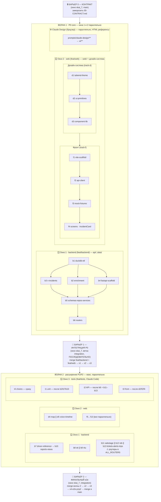

# EXECUTION — параллельная разработка через вложенные worktree

> Всё внутри одного проекта `skai_7`. Параллельность — через **git worktree в `.worktrees/`**
> (папка игнорируется git), каждая открывается **отдельным окном VS Code** со своей сессией Claude Code.
> Источник истины — `00-CONTRACT.md`.

## Структура
```
skai_7/
├── api/  web/  prompts/  ...        ← основной чекаут (ветка main)
└── .worktrees/            (gitignored)
    ├── backend  [feat/backend]      ← окно 1: api/, data/seed/
    ├── web      [feat/web]          ← окно 2: web/
    └── tests    [feat/tests]        ← окно 3: Claude Code · track-t-tests (api/tests, web vitest)
```
В каждой `.worktrees/<name>/START.md` — очередь промптов и владение.

## Как открыть в VS Code (каждую — своим окном)
```bash
code /Users/dimausac/projects/skai_7/.worktrees/backend
code /Users/dimausac/projects/skai_7/.worktrees/web
code /Users/dimausac/projects/skai_7/.worktrees/tests
```
Или File → Open Folder → выбрать папку worktree → Open in New Window. В каждом окне открой панель
Claude Code и дай промпт волны (см. START.md). Окна работают **одновременно** — разные ветки, разные файлы.

### Как запускать промпт в Claude Code

**Один промпт = одна задача Claude Code.** В нужном окне открой панель Claude Code и дай команду:

```text
Выполни промпт @prompts/v2-fullstack/track-b-backend/b1-duckdb-etl.md
```

(`@`-ссылка подставит файл; либо просто «выполни b1»). Дождись завершения и проверки, затем следующий
по очереди из `START.md`. Промпты одной под-волны без зависимостей (например `b2`∥`b4`) можно дать сразу.

### Где запускать барьеры

Барьеры (`x1`–`x4`) выполняются **НЕ в worktree, а в основном окне `skai_7`** на ветке `integration`:

```bash
code /Users/dimausac/projects/skai_7        # основное окно (или просто оно уже открыто)
```

Затем в Claude Code этого окна просто дай промпты по одному —
`@prompts/v2-fullstack/wave-x-integration/x1-remove-streamlit.md` → `x2` → `x3` (→ `x4` на барьере 2).
**Каждый x-промпт самодостаточен:** содержит свою git-склейку веток на `integration`, проверку
корректности предыдущего шага и (x3/x4) продвижение `main` только при зелёном smoke — так `main`
всегда остаётся в стабильном состоянии (последний зелёный P0/релиз).

## Почему без конфликтов
Контракт §5/§7.7 закрепил непересекающиеся папки: `api/` ⟂ `web/` ⟂ `api/tests/`. Каждый worktree —
своя ветка, мерж чистый. Роуты `App.tsx` и корневые файлы (`Makefile`, `requirements*`) трогает только
integration (x1/x2), поэтому в параллельной фазе их никто не делит.

## Порядок этапов

Единая схема (барьеры — в основном окне `skai_7`, волны — в worktree параллельно):

- **Барьер 0 — контракт** (`skai_7`, `main`): заморозить `00-CONTRACT.md`. Без него треки не стартуют.
- **Волна 1 — P0 core** (backend ∥ web): BACKEND b1→b6 ; WEB d1→d3, f1→f4.
- **Барьер 1 — интеграция P0** (`skai_7`, ветка `integration`): x1→x2→x3.
- **Волна 2 — расширение P1/P2** (макс. параллельно): BACKEND b7→b10, b8∥b9, b11∥b12∥b13 ; WEB d4∥d5, f5–f13 ; TESTS T1–T3.
- **Барьер 2 — финал** (`skai_7`, `integration`): x4 (+ повтор x2/x3) → merge в `main`.
- **Волна 3 — доработки (бэклог)**: накопленные неблокирующие правки из аудитов. Не блокирует P0/P1/P2; выполняется по мере готовности треков. См. раздел [«Волна 3 · бэклог доработок»](#волна-3--бэклог-доработок).

> **Заморозка `main` на время волн.** Все коммиты идут в `feat/*` и `integration`; **в `main` напрямую
> не коммитим**. `main` продвигается только барьерами через `git merge --ff-only integration` (x3 для P0,
> x4 для P1/P2). Любой прямой коммит в `main` во время волн разведёт ветки и сломает ff-only.

## Волна 3 · бэклог доработок

Неблокирующие правки и улучшения продукта, выявленные аудитами после Волн 1/2. Не входят в
P0/P1/P2-скоуп; **барьер не нужен** — каждый пункт выполняется на ветке трека-владельца по мере
её готовности и приезжает в `integration`/`main` обычным мержем. Порядок между пунктами не важен
(зависимостей нет). Промпты лежат в `prompts/v2-fullstack/wave-3-backlog/` (один пункт = один файл).

| # | Промпт | Трек | Источник / детали | Приоритет |
| --- | --- | --- | --- | --- |
| W3-1 | [`wave-3-backlog/w3-1-b13-ticket-sync.md`](wave-3-backlog/w3-1-b13-ticket-sync.md) — синхронизировать промпт `b13` с contract-change #1: дефолт статуса `Ticket` `"new"` → `"active"` (значение `new` удалено из enum `Status`); добавить в схему `Ticket` поля `deadline` и `is_overdue` (оверлей «⏱ Просрочено», не статус). | b13 / backend | `track-b-backend/b13-tickets-alerts-trips.md:15,17` vs `00-CONTRACT.md` §7.5 | Средний (до реализации `tickets_service`) |
| W3-2 | [`wave-3-backlog/w3-2-diagnostic-source-data.md`](wave-3-backlog/w3-2-diagnostic-source-data.md) — данные для `Source=DIAGNOSTIC`: значение объявлено в §3.1, но в `data/analysis/alarm_types.json` нет строки с `source:"DIAGNOSTIC"` → бейдж «⚙ Диагностика» (макет 07) ни на чём не срабатывает. | b1 / данные | `00-CONTRACT.md` §3.1 (changelog #1) vs `alarm_type_catalog` (14 строк) | Низкий (демо-опционально) |

> Закрытый аудитом дефект Волны 1 (b2 `_SPEED_LIMIT_TABLE` на legacy-кодах) исправлен в рамках Волны 1
> (ветка `feat/backend`, fix(b2)) и в бэклог не выносится.

**Как запускать.** В окне трека-владельца (например `.worktrees/backend` для W3-1/W3-2) дай промпт
обычным порядком, без отдельного барьера:

```text
Выполни @prompts/v2-fullstack/wave-3-backlog/w3-1-b13-ticket-sync.md
```

Новый пункт бэклога → добавь файл `wave-3-backlog/wN-*.md` + строку в таблицу выше.

## Подробная схема выполнения

Что запускать → в каком окне → где барьеры синхронизации.



### Барьеры синхронизации — где и какой промпт

Все барьеры выполняются в **основном окне `skai_7`** (не в worktree), последовательно.

| Барьер | Ветка | Промпты / артефакт | Что делает |
| --- | --- | --- | --- |
| 🔒 0 · Контракт | `main` | `00-CONTRACT.md` (артефакт, замораживается вручную) | фиксирует поля, схемы §7.5, токены — источник истины; до заморозки треки не стартуют |
| 🚧 1 · Интеграция P0 | `integration` | `x1-remove-streamlit.md` → `x2-wiring.md` → `x3-e2e-smoke.md` | выпил Streamlit, склейка React↔FastAPI (`ALL_ROUTERS`, `App.tsx`), сквозной smoke |
| 🏁 2 · Финальный e2e | `integration` → `main` | повтор `x2`/`x3` → `x4-e2e-p1p2.md` | smoke на полном наборе P1/P2 (voice/NLU/reports/tickets/alerts/trips/REB/sabotage) |

> Файлы барьеров: `prompts/v2-fullstack/wave-x-integration/`.

### Окна и владение

| Окно | Worktree / ветка | Владеет папками | Открыть |
| --- | --- | --- | --- |
| 1 · Backend | `.worktrees/backend` / `feat/backend` | `api/`, `data/seed/`, `data/skai.duckdb` | `code .worktrees/backend` |
| 2 · Web | `.worktrees/web` / `feat/web` | `web/` | `code .worktrees/web` |
| 3 · Tests | `.worktrees/tests` / `feat/tests` (Claude Code · `track-t-tests`) | `api/tests/`, vitest | `code .worktrees/tests` |
| Интеграция | `skai_7` / `integration` | корневые: `App.tsx`, `Makefile`, `requirements*` | основное окно |

### Волна 1 — P0 core (окна 1 и 2 одновременно)

| Окно | Промпты (порядок) | Проверка |
| --- | --- | --- |
| 1 Backend | `b1` → (`b2` ∥ `b4`) + `b3` → `b5` → `b6` | `make db` (54 аларма / 14 типов + `v_incidents`), `make api`, `GET /api/incidents` |
| 2 Web | `d1` → `d2` → `d3` → `f1` → `f2` → `f3` → `f4` | `VITE_USE_FIXTURES=true`, `npm run dev`, `npm run typecheck` |

> Коммит после волны: `git add -A && git commit -m "feat(backend): wave 1"` (аналогично для web).

### Барьер 1 — интеграция P0 (основное окно `skai_7`, последовательно)

**Шаг 1 — склейка веток:**

```bash
cd /Users/dimausac/projects/skai_7
git checkout integration && git merge feat/backend && git merge feat/web
```

**Шаг 2 — в Claude Code основного окна по одному промпту, дожидаясь проверки каждого:**

```text
Выполни @prompts/v2-fullstack/wave-x-integration/x1-remove-streamlit.md
Выполни @prompts/v2-fullstack/wave-x-integration/x2-wiring.md
Выполни @prompts/v2-fullstack/wave-x-integration/x3-e2e-smoke.md
```

### Волна 2 — расширение P1/P2 (макс. параллельно)

| Окно | Промпты | Примечание |
| --- | --- | --- |
| 1 Backend | `b7`→`b10` ; `b8` ∥ `b9` ; `b11` ∥ `b12` ∥ `b13` | ⚠ `b11`/`b13` добавляют свои роутеры в `api/routers/__init__.py` (`ALL_ROUTERS`), иначе `x2` отдаёт 404 |
| 2 Web | `d4` ∥ `d5` ; `f5`…`f13` (все параллельно) | — |
| 3 Tests | `t4` сразу · `t1` после `b2/b7/b10` · `t2` после `b6`+`b11–b13` · `t3` после `d2/f2/f4` | перед прогоном `git fetch && git merge integration`; баги эскалируются, в тестах не правятся |

### Барьер 2 — финальный e2e (основное окно `skai_7`)

**Шаг 1 — подтянуть волну 2:**

```bash
cd /Users/dimausac/projects/skai_7 && git checkout integration
git merge feat/backend && git merge feat/web
```

**Шаг 2 — в Claude Code основного окна:**

```text
Выполни @prompts/v2-fullstack/wave-x-integration/x2-wiring.md
Выполни @prompts/v2-fullstack/wave-x-integration/x3-e2e-smoke.md
Выполни @prompts/v2-fullstack/wave-x-integration/x4-e2e-p1p2.md
```

**Шаг 3 — финал в main:**

```bash
git checkout main && git merge integration
```

## Слияние
```bash
# в worktree после волны:
git add -A && git commit -m "feat(backend): wave 1"
# в основном репо:
cd /Users/dimausac/projects/skai_7
git checkout integration && git merge feat/backend && git merge feat/web
# track-t-tests перед тестами: в .worktrees/tests → git merge integration
```
Финал: `integration` → `main`.

## Очистка по завершении
```bash
git worktree remove .worktrees/backend   # и т.д.
git branch -d feat/backend feat/web feat/tests
```
